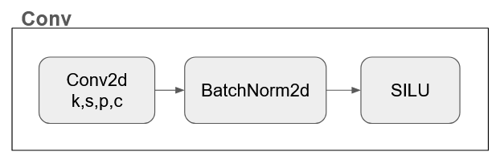
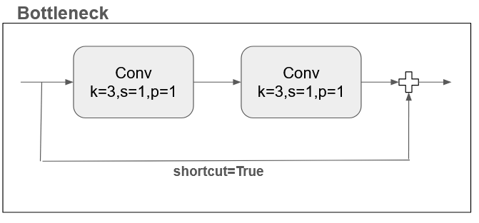
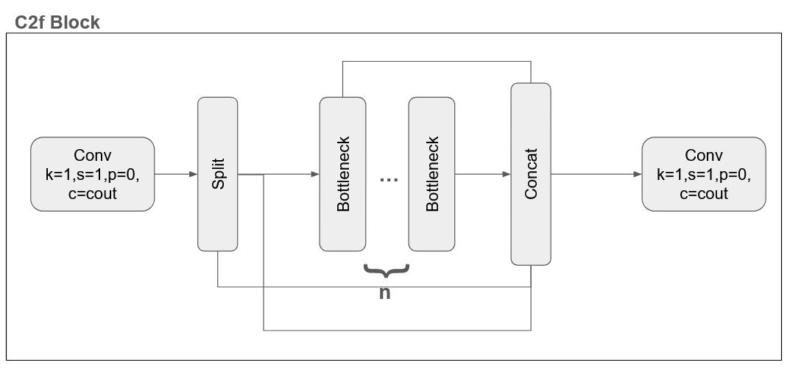
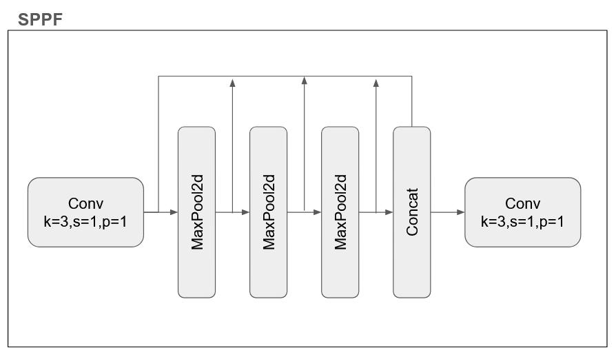
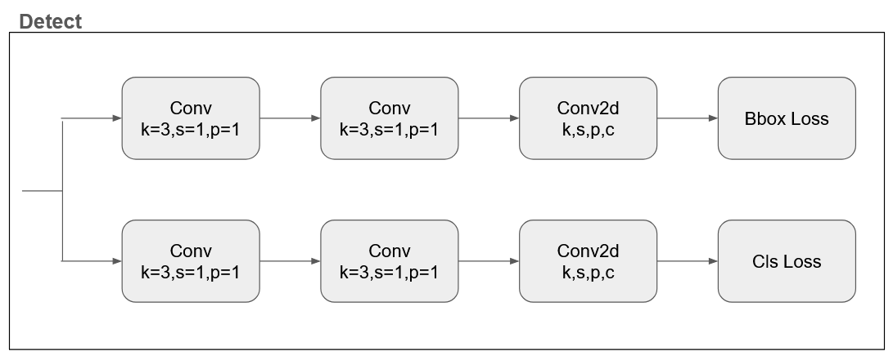

# YOLOv8 Implementation From Scatch 

In this project, we re-implement the architecture proposed in the paper [Real-Time Flying Object Detection with YOLOv8](https://arxiv.org/pdf/2305.09972), adapting it specifically for car detection in images.

## Project description
We reimplemented the YOLOv8 (You Only Look Once) architecture completely from scratch and used it for car detection.

## Results
(image)
(description of the image)

## Installation 
(if we want)(dobbiamo vedere un secondo che costruiamo il file di training e testing)

## Run the code 
(same previous motivation)(if exist installation section)

## Testing 
(same previous motivation)(if exist installation section)

## Architecture
### Building Blocks 

#### Convolutional Block

It is the most basic block in the architecture, comprising a Conv2d layer, a BatchNorm2d layer, and the SiLU activation function.

- Conv2d Layer: Convolution involves sliding a small matrix (known as a kernel or filter) over the input data, performing element-wise multiplication, and summing the results to generate a feature map. The "2D" in Conv2D refers to the application of convolution across two spatial dimensions, typically height and width. A conv layer has $k$ learnable kernels, a stride $s$, padding $p$ and $c$ input channels.

- BacthNorm2d Layer: Batch Normalization is used to enhance training stability and speed up convergence. It normalizes 2D inputs, ensuring that the values within the network are well-scaled, preventing issues during training.

- SiLU Activation Function: The SiLU (Sigmoid Linear Unit) is defined as:

  $$SiLU(x) = x * \sigma(x) = \frac{x}{1 + e^{-x}}$$

  Where $\sigma(x)$ is the sigmoid function. The key characteristic of SiLU is that it allows for smooth gradients, which can be beneficial during the training of neural networks. Smooth gradients can help avoid issues like vanishing gradients, which can impede the learning process in deep neural networks.

#### Bottleneck Block

The bottleneck block consists of two Conv Blocks and an optional shortcut connection. When the shortcut is enabled, it provides a direct path that bypasses the Conv Blocks, also known as residual connection, that allows the gradient to flow more easily through the network during training, addressing the vanishing gradient problem and allowing the model to choose to use the identity mapping provided by the shortcut, making it easier to learn the identity function when needed. 

#### C2f Block:

The C2f block begins with a convolutional block, after which the resulting feature map is split. One portion of the feature map is directed to a Bottleneck block, while the other bypasses it and goes straight to the Concat block. The number of Bottleneck blocks used within the C2f block is determined by the model's depth_multiple parameter. Finally, the output from the Bottleneck block is concatenated with the bypassed feature map, and this combined output is fed into a concluding convolutional block.

#### SPPF Block

The SPPF (Spatial Pyramid Pooling Fast) Block consists of an initial convolutional block followed by three MaxPool2d layers. The feature maps produced by these MaxPool2d layers plus the output of the initial conv block are then concatenated and passed through a final convolutional block. The core idea of Spatial Pyramid Pooling (SPP) is to divide the input image into a grid, pooling features from each grid cell independently. This allows the network to effectively handle images of varying sizes by capturing multi-scale information, which is especially useful for tasks like object recognition, where objects may appear at different scales within an image.

While traditional SPP can be computationally intensive due to the multiple pooling levels with different kernel sizes, SPPF (SPP-Fast) optimizes this process by using a simpler pooling scheme. SPPF may utilize a single fixed-size pooling kernel, reducing the computational burden while maintaining a trade-off between accuracy and speed.

The MaxPool2d layers in this block are responsible for downsampling the spatial dimensions of the input, which reduces computational complexity and helps extract dominant features. Max pooling retains only the maximum value within each pooling region, effectively discarding less important information. In MaxPool2d, pooling is applied across both the height and width dimensions of the input tensor.

The main function of the SPPF block is to generate a fixed feature representation of objects in various sizes within an image, without needing to resize the image or losing spatial information.

#### Detect Block

The Detect Block in YOLOv8 handles object detection using an anchor-free approach, predicting object centers directly rather than relying on anchor boxes. This streamlines the process by reducing the number of box predictions and speeding up post-processing

**Important Note**: In our setup, we're using a single branch to predict bounding box coordinates, confidence and class simultaneously, though a two-branch approach is also possible.

### The Three parts of Yolo-v8

Now that we've explained the individual blocks, let's introduce the overall architecture of YOLOv8.

The architecture consists of three main sections: Backbone, Neck, and Head.

- Backbone: this is the deep learning architecture that acts as the feature extractor for the input image.

- Neck: this section combines the features from various layers of the Backbone. It is responsible for upsampling the feature map and merging features from different layers. The Concat block in this section sums the output channels of concatenated blocks without changing their resolution.

- Head: this section predicts the classes, bounding boxes coordinates and confidence of objects, producing the final output of the object detection model.

Each of the building blocks has an identifier within the architecture. Note that diagram shows an input image size of 640 x 640, but, due to the original dimension of the dataset images, we have opted for 128 x 128, which changes the dimensions of intermediate blocks and the output.

**Important Note**: we are using a single detect block, but using three detect blocks, as shown in the diagram, could allow for specialized detections based on object size:
- The first Detect block, connected to Block 15, specializes in detecting small objects, utilizing a smaller grid size.
- The second Detect block, connected to Block 18, focuses on detecting medium-sized objects.
- The third Detect block, connected to Block 21, is designed to detect large objects, utilizing a larger grid size.

## Repository Content
