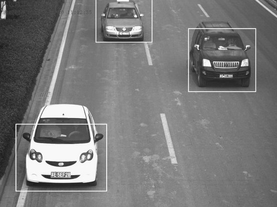

# YOLOv8 Implementation From Scratch for Car Detection

In this project, we re-implemented the YOLOv8 architecture by [Ultralytics](https://docs.ultralytics.com/models/yolov8/), using it for car detection.

## Project description
We reimplemented the YOLOv8 architecture completely from scratch and used it for car object detection. Object detection is a computer vision task that involves identifying and locating objects within an image or video. It goes beyond simply recognizing what objects are present (object classification) by also determining where these objects are situated.

YOLO models are well-regarded for their efficiency, making them popular choices for applications ranging from autonomous vehicles to video surveillance and more. YOLOv8 is the eighth iteration of the YOLO (You Only Look Once) series, which is a popular family of real-time object detection models. YOLOv8 builds on the advancements made in previous versions, offering improved performance in terms of speed and accuracy.

## Results
(image)
(description of the image)

## Dataset

We used the Kaggle ["Car Object Detection"](https://www.kaggle.com/datasets/sshikamaru/car-object-detection) dataset. The dataset, containing images of cars in all views, is originally divided in training and test set, and contains a csv with the label $(id, x_{max}, y_{max}, x_{min}, y_{min})$ for the training.

### Annotation of the Test Set
Since the test set has no ground truth, we used a [software](https://annotate.photo/) to annotate it, getting the ground truth values in JSON format. We then wrote a simple parser in order to obtain the encoded ground truth, that we can compare with the model predictions.  

## Metrics for Evaluation

We quantitavely test the model using IoU for each bounding box come metric.
The average precision is not so relevant in our case, since we have only one class to predict and generally 1 or few bounding boxes 

## Installation 
(if we want)(dobbiamo vedere un secondo che costruiamo il file di training e testing)

## Run the code 
(same previous motivation)(if exist installation section)

## Testing 
(same previous motivation)(if exist installation section)

## Acknowledgments

- Yolov8 real time detection paper
- Original Yolov8 paper (?)
- Ultralytics website (?)
- Some youtube videos and websites (?)
